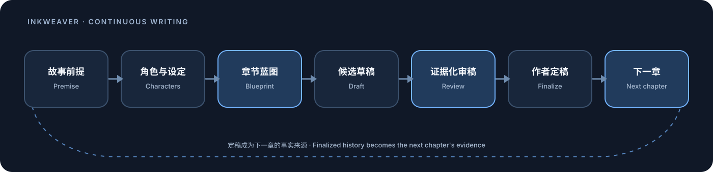

**English** | [中文](README.md)

# InkWeaver / 织墨

InkWeaver is a local-first desktop workspace for long-form fiction. It brings project settings, characters, worldbuilding, chapter blueprints, prose, review, revision, and finalization into a traceable writing chain while keeping the author in control of every durable change.

Current version: **v1.2.7**

> **Turn a long novel into one continuously developing story.** InkWeaver is a local-first AI writing workspace that connects story premises, character state, chapter blueprints, candidate drafts, evidence-backed review, and author-approved finalization into one traceable writing loop.

The v1.2.7 Windows/macOS installers will be published after qualification. The DSH plugin tarball remains available in the v1.2.0 Release; npm publication remains out of scope.

[Download v1.2.7](https://github.com/shuishuipingan/InkWeaver/releases/tag/v1.2.7) · [Start your first chapter in three minutes](docs/quickstart/README.md) · [Install the DSH plugin](plugins/inkweaver-dsh/README.md) · [Ask a question or report a problem](https://github.com/shuishuipingan/InkWeaver/issues/new/choose) · [Join the discussion](https://github.com/shuishuipingan/InkWeaver/discussions)




### Who it is for

- Authors planning a multi-chapter, serial, or multi-volume story who need characters, foreshadowing, and world rules to survive across chapters;
- Writers who want AI to propose material while the author keeps the final decision;
- People who want project files to remain local and every model call, review, recovery, and export to have traceable evidence.

### Who it is not for

- Anyone looking only for a disposable chat response without project structure or continuity;
- Anyone expecting bundled model quota, an online reading community, or an automatic literary-quality guarantee.

### Understand the workflow in three minutes

1. Define the premise, genre, writing language, target chapter count, and creative strategy.
2. Maintain characters, worldbuilding, story threads, and a chapter blueprint.
3. Generate a candidate draft and inspect its context/source receipt.
4. Ask AI for a structured review, then choose what you want to handle, defer, or verify.
5. Inspect the diff and finalize the chapter; the next chapter reads only author-confirmed continuity facts.

New contributors should next read the [project file guide](docs/PROJECT-FILE-GUIDE.md), the [1.2.0 feature and acceptance map](docs/upgrade/INKWEAVER-1.2.0-FEATURE-AND-ACCEPTANCE-MAP.md), the [global logging receipt](docs/upgrade/GLOBAL-LOGGING-ACCEPTANCE-RECEIPT-2026-09-13.md), and the [GitHub/distribution receipt](docs/upgrade/GITHUB-DISTRIBUTION-RECEIPT.md). User-visible changes are listed in the [changelog](CHANGELOG.md); contributors can read [CONTRIBUTING.md](CONTRIBUTING.md) and the [Roadmap](ROADMAP.md). The historical [1.1.0 feature map](docs/upgrade/INKWEAVER-1.1.0-FULL-FEATURE-MAP.md) remains available for context.

If this workflow fits the way you write, try the sample project through one chapter first, then share a reproducible experience through [Issues](https://github.com/shuishuipingan/InkWeaver/issues/new/choose) or [Discussions](https://github.com/shuishuipingan/InkWeaver/discussions). If the direction is useful, a GitHub star helps other long-form authors find it.

## What InkWeaver is for

Chat tools can generate a passage, but they rarely maintain character state, world rules, chapter plans, and causal continuity across a full novel. InkWeaver supplies that missing orchestration layer: project facts have clear ownership, generation runs carry explicit context and state, review findings require author confirmation, and finalized chapters become the factual foundation for later work.

InkWeaver is not a hosted model service or an online fiction platform. It includes no model quota. You connect a local model or a cloud account you are authorized to use, and project data stays local by default.

## Writing workflow

1. Define the premise, genre, writing language, and creative strategy.
2. Create or edit characters, relationships, worldbuilding, and story architecture.
3. Plan the whole-book outline and per-chapter blueprints.
4. Choose a model and target length for each chapter draft.
5. Ask AI for a structured review, then edit, ignore, add, and confirm its findings.
6. Revise from the human-confirmed checklist and inspect the diff before merging.
7. Finalize the chapter, project continuity facts and narrative threads, then continue to the next chapter.

## Core capabilities

- **Long-form continuity context** carries explicit premises, characters, worldbuilding, blueprints, and finalized facts into later writing.
- **Foreshadowing and narrative threads** track planned, planted, progressing, resolved, and overdue story threads.
- **Per-chapter model and length control** applies to single and continuous writing runs. Duplicate jobs for the same target are blocked.
- **Human-confirmed review loop** keeps AI findings editable and non-authoritative until the author confirms them, revises, and inspects the diff.
- **Reference material and knowledge retrieval** support TXT, Markdown, and EPUB import, semantic search, and SQLite full-text fallback.
- **Character cards and relationship graph** keep structured character facts and support zoom, pan, or clear operations.
- **Recoverable operations** record safe-boundary progress for long generation, batch writing, imports, drafting, character extraction, review, review-driven revision, revision, finalization, finalization post-process repair, architecture generation, configuration generation, and chapter-blueprint generation. Resume actions reload authoritative sources or safe startup inputs and validate the current project lease without storing prose or model output in the checkpoint.
- **Independent UI and writing languages** let the interface and the novel use different languages.
- **More precise failure messages** distinguish content restrictions, provider failures, prompt-budget exhaustion, and resource conflicts from successful output.

## The 1.2.0 writing and observability line

InkWeaver 1.2.0 is designed around a long novel as a changing system: every chapter inherits only verified material, every model suggestion remains reviewable, and every boundary leaves an auditable event. The user-facing scope is:

- **Independent stage-aware Writing Skills** can be installed from a validated `SKILL.md`, removed, reloaded, and filtered for planning, drafting, review, or polish. User and project Skills remain isolated by the main-process path and project lease.
- **Main/sub-story-line progress** shows planned, planted, progressing, resolved, dormant, and overdue projections with next-target chapters and event counts. Each evidence action revalidates the active project session before opening the finalized source.
- **Planning-material import** accepts outlines, world notes, character sheets, timelines, and style notes. Imports are hashed candidates; only explicit author confirmation makes them eligible for blueprint and drafting context. Duplicate content is idempotent, while conflicts and rejection remain readable.
- **Authoritative character state** accepts explicitly confirmed blueprint/candidate characters only. Model-discovered characters stay in a candidate queue. State history records author, model, or legacy-unknown provenance, finalized draft ID, content hash, and evidence range.
- **Complete Chinese long-form flow** freezes project session, writing language, UI locale, model lease, and source fingerprints from blueprint through candidate draft, review, revision, and finalization. Draft candidates never become finalized history automatically.
- **Four-layer chapter materials** keep author tasks, future plans, finalized history, unfinished candidates, and adjacent prose spans separate. Receipts show included/omitted reasons; mandatory author requirements cannot disappear silently when a budget or source is insufficient.
- **Evidence-aware review** reports each blueprint key event as completed, prepared, deferred, not-found, or needs-verification with source evidence. Revision targets are author selections; insufficient evidence never triggers an automatic rewrite.
- **Candidate lineage in continuous drafting** reads the actual saved candidate ID/version/full content for the next chapter, including after tab close/reopen or restart, rather than copying only a tail or consulting finalized history.
- **Durable global runtime logs** capture main/renderer console levels, IPC handlers, workflow UI, model calls, updater lifecycle, MCP child stdout/stderr/lifecycle, filesystem/database boundaries, window events, uncaught errors, and unhandled rejections. Events carry identity, process/PID, sequence, run/project/correlation IDs, outcome, timing, and error metadata.
- **Log integrity and diagnosis** use append-only JSONL segments, date/size rotation, per-segment SHA-256 manifests with event counts and sequence bounds, retry queues, emergency spool, restart de-duplication, persisted paging, explicit degraded status, and a safe complete-bundle export. Long messages, paths, and credentials are bounded or redacted by default.
- **Concurrency and release regressions** fence stale draft/review/revision results, verify recovery fingerprints, export finalized authority only, isolate split-export directories, preserve full completion titles, classify expected Windows helper exits, and keep queued update checks monotonic.
- **Windows/macOS updates** share one UpdateService state machine for Windows x64, macOS arm64, and macOS x64, with single-flight checks, stable asset metadata, downloaded-version monotonicity, and in-app download/install actions.

## The 1.1.0 writing-experience line

The goal of 1.1.0 is to make a long novel feel like one continuously developing
story rather than a sequence of unrelated generations. The following pieces are
already implemented in the development line:

- **Chapter continuity sheets** record scene entry state, goal, obstacle, choice, consequence, and exit state while distinguishing author plans, AI candidates, confirmed facts, and observed prose. The same sheet can record volume-level contributions, emotional carry-over, reader expectations, and viewpoint landing points.
- **Evidence-backed handoffs** preserve the previous finalized scene, viewpoint, unfinished actions, immediate goal, emotion, and open questions with manuscript evidence. When the source final changes, the old handoff is no longer presented as current.
- **Serial reading and repetition notes** present finalized chapters in authoritative order with chapter boundaries, search, reading-position memory, and an editor return action. Repeated openings, endings, or weather openings are suggestions only; authors can explicitly keep intentional repetition.
- **Layered pre-writing context** selects complete entries instead of cutting through evidence or negation. The AI output surface reports what was included and what was omitted, while the receipt avoids copying private prose.
- **Knowledge boundaries and false beliefs** separate facts, beliefs, rumors, and false beliefs with acquisition method, source chapter, validity range, and evidence. Only confirmed knowledge active at the current chapter enters drafting context.
- **Safe historical revision** lists downstream continuity projections, handoffs, and narrative lines affected by an older edit. Revision proposals bind to the base-content fingerprint and refuse to merge after the source changes.
- **Field-level character review** keeps evidence, aliases, relationships, and current state on extraction candidates. Authors can accept individual fields; unchecked values never enter the authoritative roster. Stable character IDs preserve references across renames.
- **Relationship graph workspace** supports name/alias search, one- and two-hop focus, relationship filtering, a keyboard-accessible list, pin/unpin/reset layout, and project-level layout persistence. Directed relationships can show arrows, source chapters, and manuscript evidence.
- **Consistency snapshots and blueprint-free export** use SQLite's backup API with file hashes, and export finalized manuscript authority even when no chapter blueprint exists.

These capabilities passed the internal engineering gates. Real-model literary
quality is not claimed by this release; authors remain responsible for facts,
style, copyright, and final approval.

## Model connections

InkWeaver supports two request protocols:

- **OpenAI-compatible** for OpenAI, DeepSeek, Ollama, the NovelAI preset, and compatible Chat Completions endpoints.
- **Native Gemini** for Google Gemini-compatible endpoints.

Advanced model settings expose supported reasoning effort, temperature, structured output, and output limits. After entering an API key and Base URL, you can fetch the model list. A custom URL must still implement one of the supported protocols.

### Ollama

Use Ollama through its OpenAI-compatible endpoint:

```text
Provider:  Ollama (local) or Custom
Protocol:  OpenAI-compatible
Base URL:  http://127.0.0.1:11434/v1
Model:     your Ollama model name, for example qwen3:14b
```

### NovelAI

NovelAI currently has minimal compatibility support. Use your own Persistent API Token and a model identifier available to your account. InkWeaver omits the standard `response_format` parameter for this endpoint. Account permissions and API differences remain subject to NovelAI's documentation.

## Data and privacy

| Data | Default location or destination |
| --- | --- |
| Settings, characters, blueprints, drafts, reviews, and finals | Local SQLite data and finalized text inside the project |
| Knowledge index | Local LanceDB data inside the project |
| Model profiles and API keys | Local user file `~/.vela/models.json` |
| App preferences | Local user file `~/.vela/config.json` |
| Local-model requests | The local or LAN inference service you configure |
| Cloud-model requests | The provider you explicitly select |

The renderer cannot directly read API keys. Electron's main process owns model calls, database access, and filesystem access. Files outside a project require a capability granted through a user-operated system picker.

## Installation and updates

### Windows x64

Download the installer from [GitHub Releases](https://github.com/shuishuipingan/InkWeaver/releases/latest):

```text
inkweaver-setup-<version>.exe
```

Windows supports in-app update checks, downloads, and installation. The installer is not code-signed, so Windows may show publisher or reputation warnings. Continue only after confirming that the file came from the official project Release.

### macOS

Apple Silicon and Intel use separate installers:

```text
inkweaver-mac-arm64-<version>-installer.dmg
inkweaver-mac-x64-<version>-installer.dmg
```

The current macOS installers do not have a Developer ID signature and are not notarized. Download only from the [formal v1.2.7 Release](https://github.com/shuishuipingan/InkWeaver/releases/tag/v1.2.7) and follow the operating system's first-launch confirmation. The desktop Release uses a seven-asset contract covering macOS Apple Silicon and macOS Intel; the DSH plugin tarball remains in the v1.2.0 Release.

## DeepSeek Harness plugin

The bundled `@shuishuipingan/inkweaver-dsh@1.2.0` package is an independent DSH plugin, not a replacement for the desktop application. It provides a narrow reviewed chain for project settings, story architecture, characters, the whole-book outline, chapter blueprints, and chapter prose. Model changes enter a Proposal inbox and become authoritative only after the user applies them. This release intentionally excludes npm; the plugin is delivered as a GitHub Release tarball with local installation instructions.

Migration note: `@ethanyoq/dsh-ai-novel-writer` was the historical package name before the repository move; it is not the 1.2.0 development-line delivery package. New installations should use only `@shuishuipingan/inkweaver-dsh`. The DSH host and its Web UI companion are maintained by the DeepSeek Harness ecosystem and are not packages from this repository.

```sh
dsh plugin --profile web add '<path-to-inkweaver-dsh-tarball.tgz>'
dsh --profile web
```

The plugin uses its own `.ai-novel` format and does not read desktop projects. See the [plugin documentation](plugins/inkweaver-dsh/README.md) for details.

The final tarball is `shuishuipingan-inkweaver-dsh-1.2.0.tgz`; the current
qualification build is 241,776 bytes with SHA-256
`0b67def78e2660ad2e29840efa158132ec00d6ec51bc81f0ed36b4067515ad66`, and the
GitHub Release asset must reproduce that digest byte-for-byte. It targets the current
official default-channel `@deepseek-ai/dsh@0.1.5-rc.1`; external
`@linxin666/dsh-web-all@0.3.20` is only the host companion and is not shipped by
this repository.

## Local development

Node.js 20+ and pnpm 11 are required:

```sh
pnpm install
pnpm dev
```

Common verification commands:

```sh
pnpm typecheck
pnpm test
pnpm test:browser
pnpm build
```

## Current boundaries

- InkWeaver does not provide model accounts, cloud quota, online publishing, or a reading community.
- A URL and key do not guarantee compatibility with every third-party API.
- Authors remain responsible for factual accuracy, quality, and copyright decisions.
- Back up important work before upgrades or migrations.

## License

The desktop application is licensed under [GPL-3.0](LICENSE). The bundled DeepSeek Harness plugin has its own MIT license.
