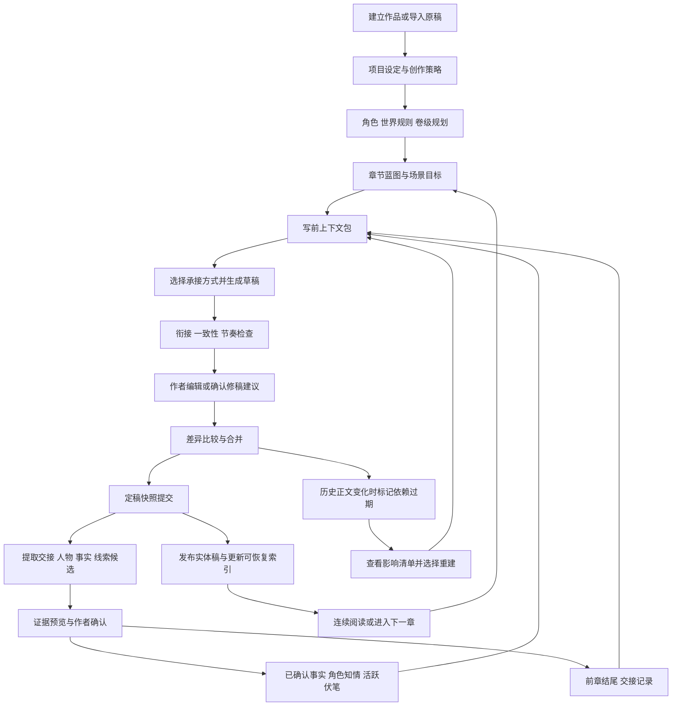
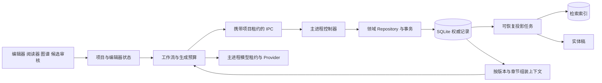
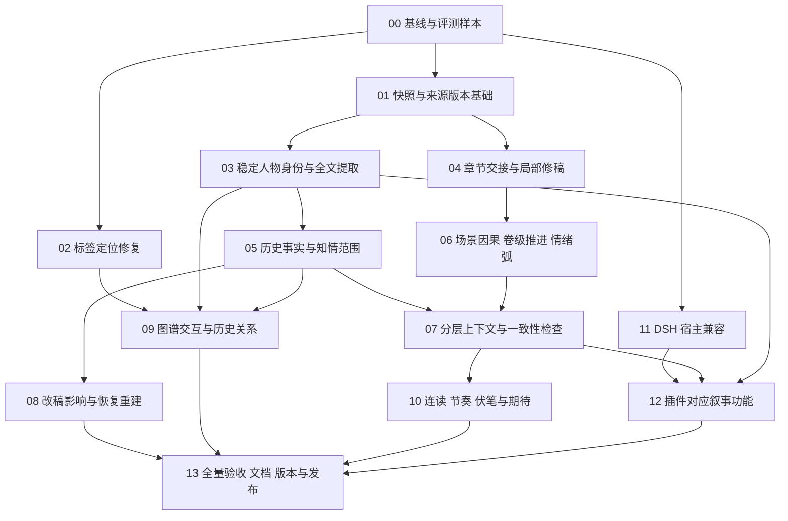

# 织墨 InkWeaver 1.1.0 完整功能图与开发交接书

编制日期：2026-09-06。

配套执行材料：[38 项需求追踪、工单与验收模板](INKWEAVER-1.1.0-DELIVERY-TRACKER.md)。接手者按本文理解功能范围，再使用追踪表记录实现和发布证据。

交付性质：产品需求、功能全景、技术边界、开发任务和发布验收说明。本文列出的新增功能尚未实现，不可直接作为已发布更新日志。

用户决定：全部路线图功能完成、验证后再发布 1.1.0。阶段编号只决定开发顺序，不表示可以提前发布缺少后续阶段功能的 1.1.0。

本文承接并完整覆盖《小说创作体验优化路线图》A–F，新增持续叙事、阅读评测、DSH 兼容、文档与跨平台发布要求。原稿位于同目录 NOVEL-CREATION-ROADMAP.md；与原稿“后续阶段”的发布范围存在差异时，以本文全部纳入 1.1.0 的要求为准。

## 1. 给接手开发者的第一条说明

当前工作目录：`D:\Game APP\AI-Novel-Writer`。GitHub：<https://github.com/shuishuipingan/InkWeaver>。

编制时本地 HEAD 为 `c089867`，本地 package.json 仍是 0.9.2；已拉取到远端 v1.0.0 标签，其 package.json 为 1.0.0。因此第一项工作是比较本地、origin/main、v1.0.0，选择正确开发基线后重新核对本文的代码观察，不能从旧版直接覆盖远端改动。

编制时存在用户原有修改 `src/tokens/__tests__/tokens.test.ts`，另有本轮新增的路线图文档。保留原有修改，不要把它们无条件丢弃或混入功能提交。

桌面应用与 DSH 插件使用不同项目格式：桌面 `.vela/vela.db`，插件 `.ai-novel/novel.db`。不得用统一版本号暗示两种格式可以直接互通。

仓库现有 ADR 与插件 AGENTS.md 是实施前必读材料；插件开发还须读取 plugins/inkweaver-dsh/docs/v2-development-gates.md。以下技术落点是建议，不要求机械沿用旧文件结构。

## 2. 产品目标与全功能树

核心目标：读者能感到人物带着之前的经历、情绪、信息和代价进入下一章，事件持续改变故事处境。作者能解释每条关键设定从何而来，并能安全修订历史章节。

```text
织墨 1.1.0
├─ A 连续叙事
│  ├─ 前章交接记录与承接方式
│  ├─ 相邻章节衔接检查与局部修稿
│  ├─ 场景链、因果链、卷级推进
│  ├─ 情绪与人物成长延续
│  ├─ 多视角与读者知情管理
│  └─ 连续阅读、重复与节奏检查
├─ B 长篇记忆
│  ├─ 固定设定 / 卷级剧情 / 历史事实 / 即时现场
│  ├─ 时间、地点、物品、伤势、能力与规则
│  ├─ 角色知情、误信、秘密传播
│  ├─ 证据、候选、人工确认与豁免
│  └─ 来源失效、改稿影响与重建
├─ C 人物资料
│  ├─ 选段 / 单章 / 多章 / 导入全文提取
│  ├─ 稳定身份、别名、同名消歧
│  ├─ 完整人物卡、阶段状态与成长弧
│  └─ 差异确认、增量合并与可恢复任务
├─ D 关系图
│  ├─ 标签定位修复、统一坐标和碰撞处理
│  ├─ 搜索、过滤、一跳/二跳聚焦
│  ├─ 有向多关系、阵营分组、详情证据
│  └─ 固定布局、章节时间轴与变化比较
├─ E 创作工作台
│  ├─ 伏笔与读者期待兑现
│  ├─ 写前上下文预览、写后审查
│  ├─ 版本比较、局部修订、影响清单
│  ├─ 成本与进度、取消与恢复
│  └─ 项目快照、导出与备份恢复
├─ F DSH 插件
│  ├─ 官方默认发布版兼容
│  ├─ Host / Agent / Client 真实安装验证
│  ├─ 持续叙事上下文与人物候选 Proposal
│  └─ 插件版本、安装包、升级与主题发现
└─ G 交付发布
   ├─ 详细中英文主页与使用指南
   ├─ 已验证变更、升级说明与已知限制
   ├─ Windows x64 / macOS ARM64 / macOS x64
   └─ GitHub 源码、正式 Release、插件分发与回读
```

## 3. 作者完整创作流程图



流程不要求作者逐个点击所有节点。可批量确认候选、保存常用生成选项；不确定身份、冲突事实和正文替换必须有明确处理。自动批量写作可以使用本次运行内的临时交接，但不能把未确认推断静默升级为全书权威事实。

## 4. 已有能力与真实缺口

| 主题 | 当前源码观察 | 本次需要补齐 |
| --- | --- | --- |
| 前后章衔接 | 已输入前章结尾、近章摘要、角色状态和知识检索 | 现场交接、情绪延续、承接策略与写后验证 |
| 长篇记忆 | 近 5 章、总约 3000 字符、事实预算 1500 字符和最多 12 条候选选择 | 分层、有时效、有证据、可回看与可重建 |
| 一致性检查 | 确定性规则主要覆盖死亡角色出场冲突 | 时间物品规则、知情范围、因果与动机 |
| 人物提取 | 定稿后发现新角色/更新状态，输入截取前 5000 字符 | 全文覆盖、别名匹配、完整资料与人工合并 |
| 关系标签 | 全局按 Y 排序向下避让，无最大偏移约束 | 局部定位、碰撞、密度控制与真实交互验收 |
| 定稿恢复 | SQLite 事务、outbox、实体稿发布和后处理机制 | 新增派生数据失效管理及安全历史修订 |
| 插件 | 旧依赖基线 0.1.0-rc.6，V1 审批文件/V2 Proposal 工作台 | 最新默认分发版兼容与本轮对应功能 |

关系标签偏移机制已由源码确定；是否还存在缩放或浮层坐标问题需用浏览器复现。源码观察不等于已跑过真实创作质量评测。

## 5. A：让小说持续发展

### A01 章节交接记录

输入：完整定稿、上一份已确认交接、当前蓝图、相关事实。输出：时间、地点、视角、在场人物、未完成动作/对话、即时目标、情绪及触发原因、限制、待回应问题。

每个提取项保留正文证据；正文中的事实与模型给下一章的建议分开存放。绑定 sourceDraftId、sourceHash、提取版本和确认版本。旧正文变化后交接过期，不能继续显示为最新。

### A02 承接与转场策略

支持紧接、跨时段、换地点、换视角、倒叙和并行事件。作者可选择自动建议或手动指定。紧接时延续动作，跨时段时交代必要后果，换视角时维护原视角未解问题。

示例：上章“门后叫出了主角名字”，下章应回应现场或明确切线；不能机械重述主角身份再开始一场无关事件。允许刻意悬置，不强迫所有悬念下一章解决。

### A03 相邻章节检查与局部修稿

检查场景跳变、情绪重置、对话中断、道具消失、重复背景介绍、章末悬念被遗忘。问题包含前章证据、本章证据、解释、修订范围。

支持仅改本章开头、仅补过渡、仅调整结尾。冻结 baseRevision，输出完整替换片段和差异；原文变化后拒绝直接应用。支持保留原文和“这是有意安排”。

### A04 场景链与因果推进（新增）

章节可拆成场景卡：进入状态 → 人物目标 → 阻碍 → 行动选择 → 后果 → 离开状态。场景分解可自动建议并供作者编辑，不强迫所有题材套模板。

章节记录“为什么发生”和“造成什么变化”。检查连续数章是否只发生热闹事件，却没有改变关系、资源、风险、认知或目标。日常、抒情章节允许以细微变化推进。

### A05 卷级故事进展（新增）

支持作品 → 卷/阶段 → 章节 → 场景。每卷记录主要目标、矛盾升级、转折、代价与待转入下一卷的问题。下一章上下文加载当前卷任务，避免局部合理但主线长期停滞。

显示章节对主线、支线和人物弧的贡献。进度是作者规划与证据，不以“高潮次数”或模型打分决定章节价值。

### A06 情绪余波与人物成长（新增）

区分短期情绪、长期信念和关系变化。重大失败、失去、胜利、背叛应在后续行为中留下影响，不能每章恢复默认性格。

人物弧记录信念 → 事件冲击 → 选择 → 代价 → 新状态；根据正文形成候选，作者确认。写作时注入相关变化，检查过快和解、突然勇敢、反复学到同一教训等现象。

### A07 读者期待与多视角连续性（新增）

分开管理读者期待和角色秘密。每条期待记录提出位置、必要推进、可延后理由和兑现证据。换视角时展示离开某条线多久、上次停在哪里。

读者知情以叙述证据记录，不等同角色知情。避免把反派独白中的秘密直接注入主角决策；回忆和不可靠叙述需标注叙事性质。

### A08 连续阅读与风格一致（新增）

增加可跨章滚动的连读视图，能显示章界、并排前章结尾/本章开头、定位问题、返回编辑器并保持阅读位置。

风格档案保留视角、时态、对话特点、叙述距离、常用称呼及作者样例。检测每章重复天气开场、背景重述、相似总结结尾和口头禅泛滥。保留刻意复沓，不做一键全书去重。

## 6. B：长篇一致性与记忆

### B01 分层上下文包

固定规则、当前卷、历史事实、即时交接分层选取。每条信息标明权威级别与来源；固定约束优先、当前场景优先，检索按人物/事件/主题和时间组合。

按完整条目裁剪，避免字符串截尾切掉出处或否定词。显示采用与省略内容及原因。模型能力不足时告知作者、允许缩小任务；不得静默舍弃决定剧情的关键限制。

### B02 历史状态与时间线

追踪物品转交、受伤恢复、能力变化、位置、所属势力和身份公开。事实具有有效范围、来源时间与确认时间，支持查询“第 N 章时的状态”。明确区分故事时间和章节顺序。

### B03 知情范围与秘密传播

记录谁通过什么事件知道什么，谁误信什么，读者知道什么。只有有证据的信息才能成为角色可用知识。保留推测及待确认状态。

### B04 一致性审查

确定性检查负责结构化冲突；模型审查负责动机、因果和复杂世界规则。问题需分类为确定冲突、疑似冲突、信息不足，并提供两端证据。作者可以修正文、修设定或记录有意安排。

### B05 改稿影响与重建

记录来源版本到交接、事实、角色、伏笔、检索索引的依赖。历史修订后列出直接过期记录与可能受影响章节；确定依赖和语义推测分开显示。

重建按依赖顺序进行，支持暂停恢复；不覆盖作者手工事实和已确认计划。当前定稿不可变设计下，历史改稿应创建新版本/替代关系，更新 ADR 后实现，不能直接修改既有不可变快照。

## 7. C：从全文提取人物资料

### C01 提取入口与覆盖

选段、当前章节、选定章节范围、TXT/Markdown/EPUB 导入全文均可提取。按场景或段落分块，有限重叠用于代词跨块识别；保留每块哈希、进度和处理状态，覆盖末尾内容。

### C02 稳定身份与消歧

稳定 characterId 配合 displayName、aliases、titles。处理一人多名和同名异人，身份不确定时请求作者选择候选，不自动合并。

现有角色以姓名作为关键标识，应先建立 ID 映射并双读兼容，再迁移关系和蓝图引用；逐次验证引用闭合和迁移回退，不得直接改主键导致旧作品人物丢失。

### C03 字段证据与合并

稳定资料、当前状态、人物弧、关系各自带来源。未提及不补写；推测与明文描述分开。支持逐字段接受、保留原值、修正后接受、拒绝候选。批量确认前显示全部影响人数与字段数。

写入通过现有角色名单原子提交和 revision 检查。重复提取幂等；人物删除/改名时检查蓝图、关系、记忆与候选引用。

## 8. D：关系图修复与增强

### D01 标签定位

删除全局 lastLabelY 累积下移策略。标签沿所属直线或曲线的几何锚点定位，局部尝试有限位置，按文字矩形碰撞检测。建议最大偏移起始值为 24 CSS px，作为可配置内部常量并通过样本调整；放不下则按优先级隐藏、悬停展开。

统一 world → CSS → backing-store 坐标转换，处理实际 devicePixelRatio。节点、边、标签、浮层和命中测试共用变换。不要分别修正缩放系数。

### D02 密度与交互

全局概览、一跳聚焦、按需二跳展开；姓名/别名搜索；按章节、人物定位、阵营、关系类型过滤。节点大小和颜色不能成为唯一信息渠道，需有文字图例与列表替代视图。

### D03 关系语义

有向、多类型、可随时间变化的关系。主从、暗恋、信任与敌对可并存。关系侧栏显示方向、完整说明、证据与更新章节；点击证据进入原文。

### D04 布局和历史

固定/取消固定节点、保存项目布局、重置布局、适合视图、阵营分组。章节滑动时间轴与两个章节状态比较依赖 B02/C02。布局保存不更改人物事实。

## 9. E：创作工作台与可靠性

| ID | 功能 | 必须交付的行为 |
| --- | --- | --- |
| E01 | 伏笔兑现面板 | 计划、埋设、推进、回收、放弃、休眠及超期提醒，全部可追踪证据 |
| E02 | 写前准备 | 显示蓝图、交接、相关人物、规则、伏笔、预算与缺失资料 |
| E03 | 写后审查 | 衔接、一致性、重复、节奏分类展示，可逐项确认和修订 |
| E04 | 安全局部修稿 | 明确修订范围、锁定保留段、差异对照、版本冲突检查 |
| E05 | 任务恢复 | 输入版本冻结、幂等收据、取消、进度、失败原因、安全节点恢复 |
| E06 | 模型成本 | 本次模型、预计调用数/输入体积、已知 token 用量；不伪造精确价格 |
| E07 | 项目快照 | 一致性数据库备份、附件清单与哈希、恢复预览、隔离恢复验证 |
| E08 | 导出完整性 | 以定稿事实枚举章节，支持无蓝图的作者原稿；验证顺序、标题、字数和缺章 |
| E09 | 双语与可访问性 | UI 和写作语言独立；所有新增入口有中英文、键盘操作和清晰错误状态 |

E07 不允许只复制正在写入的单个 SQLite db 文件；需使用备份 API 或受控一致性方案。快照含作品私有数据，不提交到源码仓库。向量索引可重建，但原始文本与权威记录必须可恢复。

## 10. 技术分层与数据关系



以下为建议新增领域对象，名称可调整，但语义必须保持：

| 对象 | 主要字段/关系 | 权威性质 |
| --- | --- | --- |
| ChapterHandoff | 定稿 ID/哈希、现场、未完成动作、情绪、证据 | 提取候选确认后使用；与下一章建议分开 |
| SceneBeat | 章节、目标、阻碍、选择、后果、证据 | 作者规划或已发生事件，显式区分 |
| ArcPlan | 卷、人物或支线、阶段目标、转折 | 作者规划 |
| CanonFact | 主体、谓词、值、有效时间、证据、替代关系 | 已确认事实 |
| KnowledgeEvent | 知情者、信息、获知方式、误信标志 | 已确认事件 |
| CharacterCandidate | 来源范围、建议字段、匹配人物、状态 | 非权威 |
| RelationEvent | 稳定人物 ID、有向关系、有效范围、证据 | 已确认事实 |
| SourceDependency | 来源版本、依赖记录、过期原因 | 系统元数据 |
| ContextReceipt | 输入来源版本、纳入/省略原因、预算 | 审计元数据，避免复制所有私密正文到日志 |
| ProjectSnapshot | 数据库备份、附件清单、哈希、版本 | 恢复材料 |

正文事实、作者规划、AI 推测、系统展示偏好不能混为一张无类型记忆表。关系视图读取事实或明确标注候选，不能让显示位置改变角色关系。

## 11. F：DSH 插件升级要求

### F01 兼容基线

2026-09-11 已查询官方 npm `@deepseek-ai/dsh`：latest 为 0.1.5-rc.1，next 为 0.1.5-rc.2，alpha 为 0.1.5-alpha.2；这里的“最新正式发布”按官方默认分发渠道理解，文案必须写明 RC，不能宣称已有稳定版。0.1.5 还要求 persona 前缀、SystemPrompt 配置和 Session 事件边界迁移。

开发开始和发布前重新查询 npm dist-tags、官方 releases 与版本源码。冻结具体包版本、tag、commit 和核对日期，禁止直接以 main 或第三方介绍作为兼容依据。

官方来源：<https://github.com/deepseek-ai/deepseek-harness/releases>、<https://www.npmjs.com/package/@deepseek-ai/dsh>。公开主题页：<https://github.com/topics/dsh-plugin>。

### F02 接口和安装

逐一检查 Host service 注入、Workspace/Session DTO、Client slot/侧栏、工具 schema、preset 发现、Proposal 生命周期、审批和打包格式。升级全部相关依赖并重建锁文件，不能只改根版本或放宽 peerDependencies。

遵守插件 V2 门禁：构建 → tarball → 隔离 profile 安装 → dump-config → 实际 preset roster → 真实 mount → 浏览器创作/Proposal → 同页应用可见 → 重启持久化读回。保留 V1 明确兼容策略和既有作品迁移路径。

### F03 对应创作功能

插件至少承接本轮持续叙事能力：按章节读取交接/相关事实与知情范围，生成章节时使用承接策略；从文本提出人物、关系和记忆候选；在工作台显示证据与差异并通过 Proposal 应用；来源改变后拒绝旧 Proposal。

复用 Host 的项目库和现有 Proposal 通道，不新增绕过作者审核的模型权威写入口。新增能力优先扩展既有 typed read/proposal 参数；若改变目前恰好两个模型工具的合同，必须先说明必要性并更新门禁和测试。

桌面连读器和 Canvas 图谱不要求原样嵌入 DSH 侧栏，插件需以可用的上下文、人物/关系列表及证据导航覆盖对应核心操作。此处是明确的界面适配边界，不是省略叙事数据和审核功能。

### F04 版本与分发

桌面目标 1.1.0；插件也按用户要求同步采用 1.1.0，并说明它是插件自身版本，不是 DSH 宿主版本。发布前确认 npm 该版本未占用且当前账号具有包发布权限。

交付插件 npm 包或可安装 tarball；若 npm 发布受认证/组织权限阻塞，不能宣称 npm 已升级。README 明确各自安装方式、兼容矩阵、数据目录和备份迁移要求。

### F05 主题页可发现性

仓库元数据已查询到 dsh-plugin、deepseek-harness、cordis-plugin、dsh、novel-writing 等 topic。发布后回读 topic，并检查主题页或 GitHub topic 搜索结果是否出现 InkWeaver；保存验证日期和链接。

主题页展示的是仓库，不是子目录或 npm 包；README 首屏必须提供插件入口。GitHub 排序和索引由平台决定，不承诺首页排名。若暂未索引，明确记录待验证，不能仅凭添加 topic 就报告实际可见。

## 12. 开发任务与先后关系



任务 02 与宿主兼容调查可并行，涉及同一数据库迁移或共享契约的任务由同一负责人协调。不要在未整合其他任务时提前冻结发布 commit。

| 工单 | 交付物 | 核心验收 |
| --- | --- | --- |
| 00 | 基线差异报告、需求覆盖表、固定样本集 | 明确 1.0.0 到开发分支差异、保留用户修改 |
| 01 | 来源版本/依赖契约、快照恢复 | WAL 场景一致备份、隔离恢复和哈希核对 |
| 02 | 图谱标签与变换修复 | 标签偏移上限、正确命中、缩放拖拽录像/截图 |
| 03 | C01–C03 全链路 | 全文覆盖、身份消歧、确认合并和幂等 |
| 04 | A01–A03 全链路 | 交接证据、正常转场不过度误报、局部差异 |
| 05 | B02/B03 和历史关系数据 | 第 N 章查询正确，角色不获知未来秘密 |
| 06 | A04–A07 | 场景后果、卷进展、情绪和期待的规划/事实分离 |
| 07 | B01/B04、E02/E03/E06 | 关键上下文保留、冲突证据、成本状态真实 |
| 08 | B05、E04/E05/E07/E08 | 历史修订、依赖失效、恢复、无蓝图导出 |
| 09 | D02–D04 | 大图谱可用、方向正确、历史比较和位置保持 |
| 10 | A08、E01/E09 | 连读定位、节奏建议、伏笔证据与双语键盘体验 |
| 11 | F01/F02 | 官方版本兼容矩阵和隔离安装真实证据 |
| 12 | F03 | 插件上下文/提取/Proposal/重启闭环 |
| 13 | F04/F05、G 全部 | 源码、三个平台安装包、插件和发布内容逐项回读 |

每个工单需附修改文件、领域约束、测试、用户可见截图/示例、迁移影响和未解决项。维护实现状态为未开始/开发中/待验收/通过，不能仅用已合并代替通过。

## 13. 代码导航

路径相对仓库根目录；用于开发定位，实施前以最新基线核实。

| 范围 | 现有主要文件 |
| --- | --- |
| 写稿和批量 | src/services/workflows/commands/generate-draft.command.ts；src/services/workflows/batch-chapter-workflow.ts |
| 定稿后处理 | src/services/workflows/commands/finalize-chapter.command.ts；electron/services/finalization-service.ts |
| Prompt 和预算 | src/services/prompts/prompt-builder.ts；src/services/generation/generation-harness.ts；generation-runtime.ts |
| 连续性和线索 | src/shared/finalized-continuity.ts；consistency-preflight.ts；narrative-thread.ts；electron/repositories/summary-repository.ts；narrative-thread-repository.ts |
| 人物事实 | src/shared/character-roster.ts；electron/repositories/character-roster-repository.ts；src/stores/character-store.ts |
| 图谱 | src/components/editor/RelationshipGraph.tsx；src/shared/relationship-presentation.ts |
| 编辑审稿 | src/components/editor/DraftEditor.tsx；ReviewReport.tsx；src/stores/editor-store.ts |
| 数据库与 IPC | electron/database.ts；electron/controllers/db-controller.ts；src/shared/ipc-channels.ts |
| 项目与权限 | electron/services/project-access.ts；src/shared/project-session-context.ts；src/services/ipc-client.ts |
| 插件核心 | plugins/inkweaver-dsh/src/novel-store.ts；agent.ts；agent-v2.ts；command-rpc.ts；src/client/ |
| 发布 | .release/release-profile.json；.github/workflows/；scripts/release-win-verify.mjs；electron-builder.json5 |

## 14. 验收与阅读质量评测

### 14.1 固定文本集合

至少覆盖 24 对相邻章节（六类各四对：即时承接、跨日、换地点、换视角、倒叙、不立即兑现悬念）、一部 100 章以上可合法使用的固定样本，以及同名/别名/回忆/传闻人物提取样本。不得把用户未授权公开的作品放入公共测试仓库。

### 14.2 两类完成证据

工程证据：数据库事务、引用闭合、revision 冲突、取消恢复、证据跳转、图谱位置、安装升级均可重复验证。阅读证据：在同模型与同输入约束下做盲评，并保留改造前后样本、评分理由和失败案例。

### 14.3 建议的首轮验收门槛

以下为交接时提出的门槛，不是当前实测结果。开发者在工单 00 固定样本与运行环境后记录执行结果，不能事后挑选样本降低标准。

- 确定性构造案例中的跨项目写入、重复提取重复建卡、旧 revision 覆盖、原稿丢失：零次。
- 标注的关键状态和远期规则检索召回率至少 95%；未知/冲突条目必须显式标注，不以错误答案补齐。
- 确定性一致性构造集应全部通过；模型语义问题同时报告精确率与召回率，不使用单一总分掩盖误报。
- 章节对盲评：至少 70% 更偏好新版；自然承接平均分提升至少 0.5/5，事实正确性不得下降。由两名评阅者独立评价，分歧留档复核。
- 正常转场与有意悬念集被误判为必须修稿的比例不超过 10%；系统只提供建议，作者可保留。
- 标签中心到所属边的偏移不超过选定上限，隐藏标签有可访问详情；20/100/200 人样本均通过缩放、拖拽、窗口变化。
- 图谱性能在记录的测试硬件上报告 p95 帧耗时、首次可交互时间与长任务；建议拖拽 p95 不超过 33 ms，达不到时优化可见集合/布局调度后复测。
- 桌面及插件旧作品升级后：正文、人物数量、关系引用、章节顺序、待审 Proposal 和可恢复任务无无声丢失。

模型、提示词版本、样本哈希、种子（若支持）、实际调用量和评测日期必须随结果保存。对不支持固定种子的模型使用多次运行，报告波动。

## 15. G：主页、版本与正式发布

### G01 文档交付

主 README 中英文都详细说明：软件定位、从零写作/导入续写两条路径、衔接与长篇一致性机制、人物提取与关系图、人工审稿、模型连接、数据存放、费用来源、备份恢复、插件安装、兼容矩阵和已知限制。

提供快速上手、连续写作示例、修订历史章节示例、人物提取示例、图谱使用说明、旧版迁移指南、故障恢复 FAQ。截图必须来自实际新版本且无私人作品/密钥。

GitHub About 简介保持一句准确的产品说明，详细功能放 README。更新日志逐项写用户问题、改变后的行为、操作入口、兼容影响；未通过验收的功能不得列入“已支持”。

### G02 版本冻结

全部工单通过后统一桌面与插件版本 1.1.0，更新 lockfile、安装包名引用、README、版本测试和 CHANGELOG。记录不可变源码 SHA；所有平台资格构建必须来自相同 SHA。源代码推送和 Release 发布是两件事，应分别记录结果。

### G03 安装包与插件分发

沿用 GitHub Actions 云端资格构建与统一提升流程，不跳过原生模块、旧版升级、实际启动、安装/卸载、更新和错误窗口检查。编制时资产合同为：

| 平台 | 正式资产 |
| --- | --- |
| Windows x64 | inkweaver-setup-1.1.0.exe；对应 .exe.blockmap；latest.yml |
| macOS Apple Silicon | inkweaver-mac-arm64-1.1.0-installer.dmg；对应 .dmg.sha256 |
| macOS Intel | inkweaver-mac-x64-1.1.0-installer.dmg；对应 .dmg.sha256 |
| DSH 插件 | @shuishuipingan/inkweaver-dsh@1.1.0 的可安装分发与完整构建字节 |

插件 tarball 如需作为额外 Release 资产，先显式扩展现有严格七资产合同及其验证器，不能绕过合同临时上传。若保持七资产合同，则通过 npm 或另行明确的插件分发页交付。

现有 Windows/macOS 签名政策允许未签名且须披露；发布时核实实际签名状态并准确说明，不能承诺未配置的签名或公证。macOS 与 Windows 的更新渠道按现有实现分别说明。

### G04 发布完成核对表

- [ ] 全部功能工单通过，需求覆盖表没有缺项。
- [ ] 中英文主页、指南、更新日志和迁移说明与实现相符。
- [ ] GitHub 远程源码 SHA、版本与 tag 一致。
- [ ] 三个平台资格证据及其 run/attempt/artifact ID 完整。
- [ ] 正式 Release 来自已验证同字节产物，全部下载链接可用。
- [ ] 安装包哈希与资产清单一致，Windows 更新元数据指向正确安装包。
- [ ] 旧版到 1.1.0 数据升级和恢复通过。
- [ ] 插件真实安装、preset mount、Proposal 同页应用及重启读回通过。
- [ ] npm 或插件分发版本回读为 1.1.0，兼容版本明确。
- [ ] GitHub dsh-plugin topic 回读成功且实际发现结果已记录。
- [ ] 向用户提供源码、Release、Windows/macOS 下载及插件安装链接。

## 16. 交接给开发者的任务说明（可直接复制）

请基于本仓库最新已验证的 1.0.0/主分支实现本文件规定的 InkWeaver 1.1.0 全部功能，保留用户已有修改。先核对开发基线，再按工单 00–13 的依赖执行；每项交付必须有相应功能与质量验收证据。重点改善持续叙事、长篇事实、全文人物提取和关系图，兼容官方默认发布的 DSH 版本，并完成插件对应升级。全部功能验收后再冻结 1.1.0、提交 GitHub、更新详细中英文主页与更新日志，通过现有云端资格流程发布 Windows x64、macOS ARM64 和 macOS x64 安装包，验证插件分发和 dsh-plugin 主题可发现性。不要把方案文档、类型检查通过或模型正常结束当成功能完成，不要把未实现内容写进正式版本介绍。
